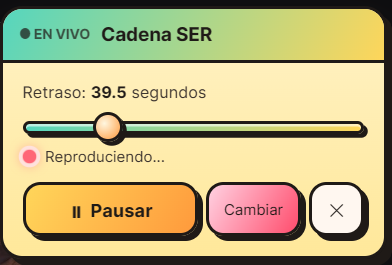

# RadioLag

Extensión de Chrome que reproduce emisoras de radio en vivo en cualquier página web y sincroniza el audio con contenido de vídeo mediante control de retraso. Ideal para ver competiciones deportivas en directo en Español ;)

## Emisoras disponibles

- **Cadena SER** — stream en directo (StreamTheWorld CDN)
- **COPE** — stream en directo (Flumotion CDN)
  > ⏱️ COPE usa balanceadores de carga que devuelven un archivo `.m3u`. La extensión resuelve automáticamente el servidor disponible, lo que puede añadir unos segundos extra de carga inicial.

## Instalación

1. Abre Chrome y ve a `chrome://extensions/`
2. Activa el **Modo de desarrollador**
3. Haz clic en **Cargar extensión sin empaquetar**
4. Selecciona la carpeta del proyecto
5. ¡Listo!

## Cómo usar

1. Navega a cualquier página web
2. Verás un **botón flotante** en la esquina inferior derecha
3. Haz clic para abrir el **selector de emisoras**
4. Elige SER o COPE
5. Usa el **slider de retraso** (0-180s) para sincronizar con el vídeo
6. El LED rojo pulsa cuando está reproduciendo

## Capturas de pantalla

### Selector de emisoras


### Reproduciendo


### Vista general


## Funcionalidades

### Silenciado automático
Al reproducir la radio, silencia todos los `<audio>` y `<video>` de la página. Al pausar, restaura el audio original. Incluye `MutationObserver` para medios dinámicos (Twitch, etc.).

### Sincronización con delay
- Slider de 0 a 180 segundos (paso 0.1s)
- Usa Web Audio API (`DelayNode`) solo cuando delay > 0
- No recarga el stream al activar el delay
- Reintento automático si falla la configuración

### Diseño cartoon-vintage
- Estilo cartoon con inspiración vintage
- Paleta crema, madera y latón
- Tipografía Playfair Display + Georgia
- LED rojo pulsante con glow
- Slider estilo radio antigua

### Cambio de emisora en caliente
Cambia entre SER y COPE sin recargar la página. El audio se pausa, limpia, y reanuda automáticamente.

### Resolución automática de streams
Resuelve archivos `.m3u` automáticamente para obtener la URL directa del stream.

## Tecnologías

- Manifest V3
- Web Audio API (DelayNode, AudioContext)
- Shadow DOM
- Google Fonts (Playfair Display)
- Playwright (tests)

## Archivos

```
├── manifest.json
├── content.js          # Lógica y UI (Shadow DOM)
├── styles.css          # Estilos cartoon-vintage
├── icons/
│   ├── icon16.png
│   └── icon48.png
├── tests/
│   ├── extension.spec.js
│   └── test-page.html
├── SPECS.md
├── package.json
└── playwright.config.js
```

---

**Streams**: Cadena SER (StreamTheWorld), COPE (Flumotion)  
**Versión**: 1.0
